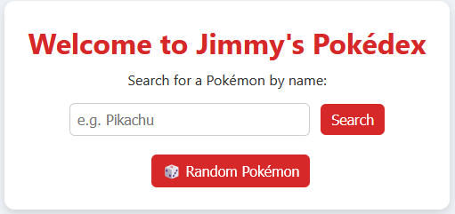
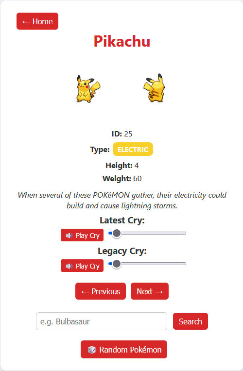

# Pokédex Web App

A full-stack Pokédex built with **Flask**, **HTML/CSS**, and **Jinja2**, using the [PokéAPI](https://pokeapi.co/) for data.  
Deployed on **Render** at [https://pokedex-jvah.onrender.com/](https://pokedex-jvah.onrender.com/).

This project was built to strengthen my backend development skills while recreating the experience of browsing a real Pokédex.

---

## 🚀 Features

- Search for any Pokémon by name
- View detailed Pokémon pages with:
  - Front and back sprites
  - Color-coded type badges
  - ID, height, weight
  - English Pokédex description
  - Audio cries with custom play buttons and volume sliders
- Next/Previous navigation
- Random Pokémon button
- Clean, custom CSS styling

---

## 🎨 Screenshots

### Home Page

### Pokémon Detail Page (Pikachu Example)

---

## 📦 Tech Stack

- **Backend:** Python 3, Flask
- **Frontend:** HTML, CSS, Jinja2 templates
- **Data Source:** PokéAPI
- **Deployment:** Render

---

## 🗺️ Future Improvements

- Add Pokémon stats with visual bars
- Display abilities
- Show evolution chains
- Filter by type
- Favorites and recently viewed Pokémon
- Dark mode toggle
- Improved mobile responsiveness

---
